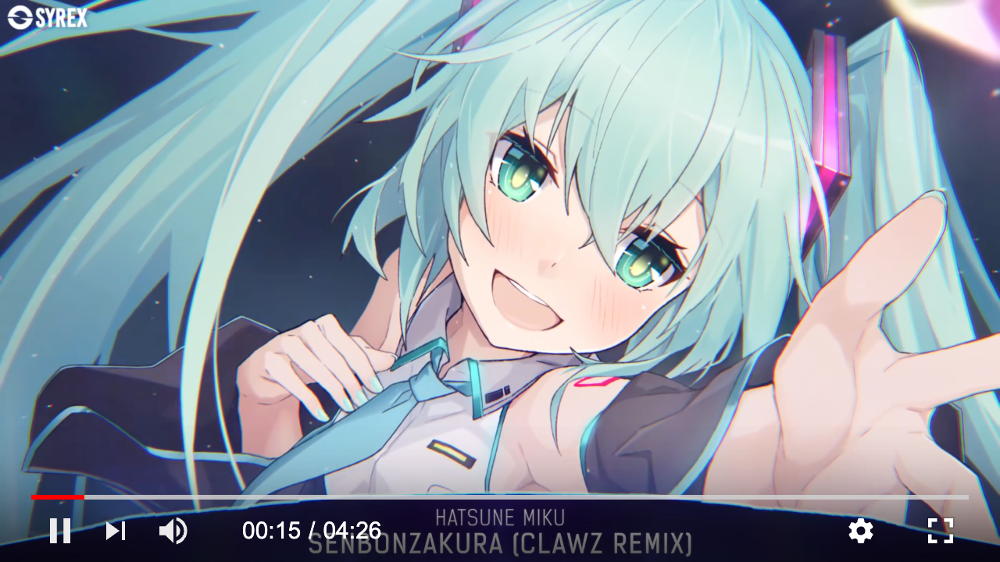

# vido

`vido` is a lightweight custom HTML5 video player demo built on top of Vue 1.x.

## Demo

Run the local demo:

```bash
npm install
npm run build
npm run start
```

Then open [http://127.0.0.1:4321/demo/index.html](http://127.0.0.1:4321/demo/index.html).



## Install

```bash
git clone https://github.com/yuxino/vido.git
cd vido
npm install
```

## Usage

### HTML

```html
<div id="V-Video" class="v-video"></div>
```

### JavaScript

```javascript
var vi = new vido({
    el: "#V-Video", // target element
    src: "https://img.yuxino.cn/static/vido/BV19t41187z2_p1.mp4", // video source
    w: "640px", // video width
    h: "360px", // video height
    autoplay: true, // autoplay
    muted: true, // recommended for modern browser autoplay
    playsinline: true // avoid forced fullscreen on some mobile browsers
});
```

### Optional poster

```javascript
var vi = new vido({
    el: "#V-Video",
    src: "https://img.yuxino.cn/static/vido/BV19t41187z2_p1.mp4",
    poster: "https://example.com/poster.jpg",
    w: "640px",
    h: "360px"
});
```

### Autoplay on modern browsers

If you want autoplay to work reliably in current browsers, use:

```javascript
var vi = new vido({
    el: "#V-Video",
    src: "https://img.yuxino.cn/static/vido/BV19t41187z2_p1.mp4",
    autoplay: true,
    muted: true,
    playsinline: true,
    w: "640px",
    h: "360px"
});
```

Browsers usually block autoplay when the video has audible sound. This repo now treats autoplay as a best-effort feature and falls back gracefully if playback is denied.

## Styling

Change the primary progress color:

```css
.v-point,
.v-loaded {
    background: red;
}
```

For example: `rgb(98, 222, 216)`.


## Notes

- The bundled assets are generated from `src/` into `dist/`.
- The current build uses an older Grunt-based toolchain and Vue 1.x.
- The demo uses the CDN source `https://img.yuxino.cn/static/vido/BV19t41187z2_p1.mp4`.

## Todo

- [ ] Publish a clearer API reference
- [ ] Polish UI details
- [ ] Rework the unused "next" control
- [ ] Fix remaining compatibility issues
